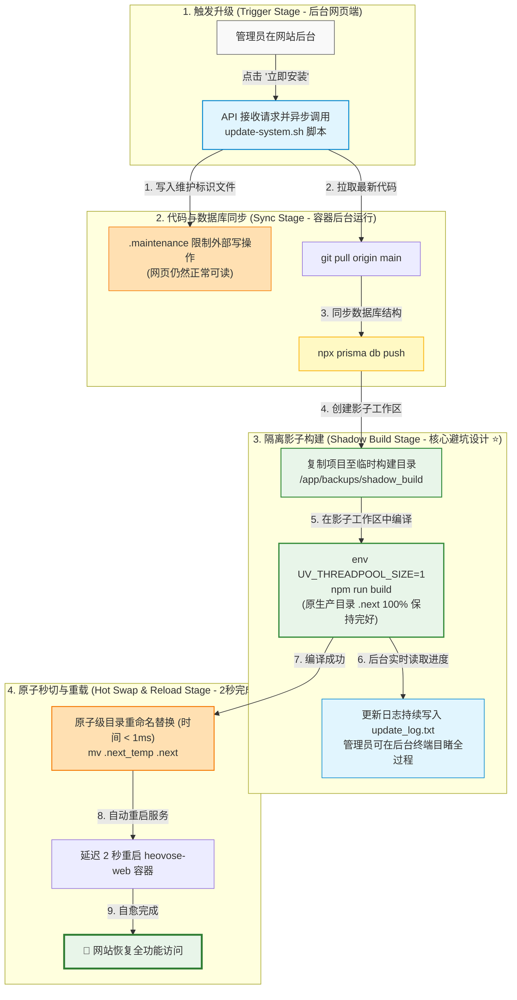

# Heovose Elevate 后台一键热更新与影子构建方案

本方案根据 Heovose 生产服务器（阿里云新加坡节点）的实际硬件与 Docker 部署拓扑，专门设计并实现了一套**支持在网站后台直接触发、零编译中断、接近零停机**的“影子编译与秒级热切换”更新方案。

---

## 📍 后台一键更新流程线路图 (Online Update Flow Roadmap)

---

## 1. 核心设计策略：容器内影子编译与秒级热切换

为了解决在网页后台点击更新时，因为编译占用 `/app/.next` 导致运行中的 Web 服务直接 502/崩溃中断的问题，我们设计并实现了 **“影子构建（Shadow Build）与原子目录秒切”** 的全新架构：

1.  **静态资源双缓存区**：
    *   **运行区 (`/app/.next`)**：正在运行的 Next.js 服务所读取的静态资源 and 网页打包块。编译期间它被 **100% 锁死且完好保留**，保证后台、前台能够一直正常提供读服务。
    *   **影子构建区 (`/app/backups/shadow_build`)**：升级进程在后台创建的临时沙盒空间。脚本会将源码和依赖复制到这里，并在这个影子空间中进行 `npm run build` 编译打包。
2.  **原子切换 (Atomic Directory Swap)**：
    *   一旦影子目录编译成功，脚本会瞬间运行：
        `mv .next .next_old && mv shadow_build/.next .next && rm -rf .next_old`
    *   由于 `mv`（移动文件夹）在 Linux 底层是基于 Inode 重定向的，**耗时低于 1 毫秒**。这意味着老版本的静态资产会无缝被新版本所替换，完全不给正在访问页面的用户造成卡顿或网络阻断。
3.  **单线程限制与内存保护**：
    *   通过限制 `UV_THREADPOOL_SIZE=1` 和 `--max-old-space-size=1024`，极大地降低了影子编译期间占用的服务器 CPU 和物理内存。保证管理员和用户的连接不会被高压负载冲断，升级日志能实时、顺畅地展示到后台的 Unix 窗口日志中。

---

## 2. 管理员后台使用说明

作为管理员，当有新版本时，您不再需要登录服务器终端进行任何操作，只需通过浏览器：

1.  **进入管理后台**：访问 `/admin/settings`。
2.  **触发更新**：点击右上角的 **“立即安装”**。
3.  **实时目睹进度**：
    *   系统更新实时进度的垂直时间线会自动激活。
    *   下方的 `Terminal` 日志终端盒会每秒刷新，打印当前正在拉取代码、复制影子工作区、编译页面文件等实时 Shell 输出。
4.  **无感过渡**：
    *   在编译的 1-2 分钟里，您可以继续随意浏览前后台的其他页面（普通用户的 GET 请求一切正常）。
    *   当终端输出 `✅ 影子编译成功！进行原子级文件夹快速切换...` 并提示正在重启容器时，说明更新已完成，此时页面仅有 2 秒钟的短重连，再次刷新后即为最新版本。

---

## 3. 容错与回滚保护

如果一键热更新过程中发生编译失败、断电或代码语法错误：
*   **清理影子**：系统会自动清除 `shadow_build` 目录，绝对不污染或碰触您正在运行的正常版本（`/app/.next` 毫发无损）。
*   **状态回传**：在编译出错的瞬间，进度条对应位置会亮起红色的 `✕` 标志，并且终端盒上方会弹出明亮的红色报错框，透传真实的编译错误，方便运维排查代码问题。
*   **不留残余**：更新完成后，系统会自动清空一切临时产物，仅保留轻量级的状态 JSON 供下次检测。
