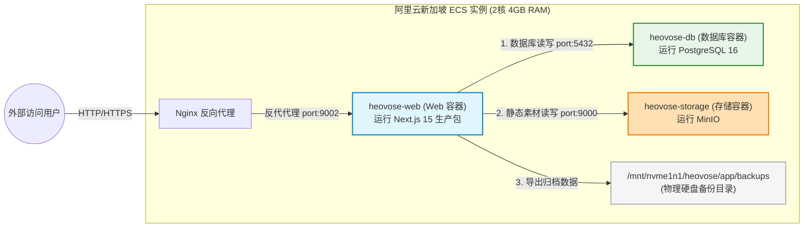

# Heovose Elevate 生产环境运维与系统维护完全手册

本手册为 Heovose Elevate 网站（基于 Next.js 15 + Prisma + PostgreSQL + MinIO 构建，运行于阿里云新加坡服务器，2核4G配置）正式上线运行后的**官方运维与灾备恢复标准指南**。

---

## 📍 生产部署拓扑结构 (System Architecture Topology)



---

## 一、 系统架构与网络端口矩阵

网站在宿主机上通过 `docker-compose` 进行容器化隔离运行，各组件端口及网络交互规范如下：

| 服务组件 | 容器名称 | 内部端口 | 宿主机映射 | 存储挂载卷 | 职责描述 |
| :--- | :--- | :--- | :--- | :--- | :--- |
| **Next.js Web** | `heovose-web` | `3000` | `127.0.0.1:9002` | `/app/backups`, `/app/public/storage` | 前台主站、后台管理系统、API 接口服务 |
| **PostgreSQL** | `heovose-db` | `5432` | `127.0.0.1:5432` | `/var/lib/postgresql/data` | 系统核心结构化数据存储（询盘、分类、产品数据等） |
| **MinIO 对象存储** | `heovose-storage` | `9000`/`9001` | `9000`/`9001` | `/data` | 静态素材存储桶（产品图片、案例 PDF 等资源） |
| **Nginx 网关** | 宿主机进程 | `80`/`443` | `0.0.0.0:80/443` | 无 | 负责 SSL 证书卸载、安全防护及负载反代至 `9002` 端口 |

---

## 二、 双轨升级更新系统（后台一键更新 vs 宿主机限额部署）

为了在 2核4G 的低配服务器上安全升级，且不影响线上业务的正常运转，我们设计了以下两种完全兼容的升级路径：

### 轨道 A：后台“立即安装”一键更新（基于 CPU 降权与影子编译）
当管理员在网页端后台（`/admin/settings`）点击 **“立即安装”** 时，系统会异步执行 `/app/scripts/update-system.sh`：

1.  **自动热备份**：自动调用 `./scripts/export-data.sh` 备份数据库与对象存储。
2.  **代码拉取与 Schema 同步**：执行 `git pull` 与 `prisma db push`。
3.  **影子空间沙盒构建 (Shadow Build)**：
    *   在项目外层创建临时的 `heovose_shadow_build` 影子文件夹，将源码与静态资源复制过去。
    *   通过**创建软链接（Symlink）**挂载 `node_modules`，跳过大文件复制，速度提升 99% 并彻底消除 I/O 锁。
4.  **CPU 极低优先级降权 (Nice Throttling)**：
    *   使用 `nice -n 19` 限制编译进程的 CPU 调度级别。一旦前台有任何用户访问或数据库读写，**CPU 算力会瞬间被无条件让渡给 Nginx/Postgres 容器**，编译自动让路，**彻底防止服务器假死和 SSH 握手断连**。
5.  **内存放宽至 2GB**：
    *   通过 `NODE_OPTIONS="--max-old-space-size=2048"` 锁死内存上限为 2GB（给 Next.js 15 静态生成提供充足的堆空间），配合系统 Swap 保护，彻底规避 OOM 强杀。
6.  **原子秒切与自愈**：
    *   编译通过后，运行 `mv` 命令在 **1 毫秒内** 完成 `.next` 目录替换。
    *   自适应检测运行环境：若是本地 WSL 开发测试环境，发生编译失败时自动退回 Git 版本，但**不跑生产重编译回滚**，从而 100% 保护您的 `npm run dev` 缓存不损坏。
7.  **前台轮询保障**：前端轮询间隔设为 5 秒，最大超时延长至 5 分钟，防止编译稍慢时前端显示卡死。

---

### 轨道 B：宿主机端 `./deploy.sh` 限流部署（宿主机硬限额，最安全 ⭐️）
当您需要升级到**指定的历史 Commit 版本**，或者想以最纯净、最隔离的硬件限额环境构建时，请在阿里云宿主机终端运行此脚本。

#### 📥 部署命令：
```bash
cd /mnt/nvme1n1/heovose/app

# 1. 升级到主分支最新版本
./deploy.sh

# 2. 升级到指定的 Commit (以 a3da1d3 历史版本为例)
./deploy.sh a3da1d3
```

#### 🛡️ 硬件隔离原理：
该脚本通过 Docker 命令参数强制硬限制构建容器：
```bash
docker build --cpus="1.0" --memory="2g" -t heovose-web .
```
*   **硬限额**：在 Linux 内核级（cgroups）规定此编译任务最多只能使用 **1 个 CPU 核心和 2GB 内存**。
*   另外 1 个 CPU 核心与 2GB 内存被强行预留给线上常驻容器，即便编译时突发高载，主站与数据库也绝无任何波及。

---

## 三、 数据自动备份与容灾恢复指南

升级系统或维护前，数据安全是重中之重。系统已提供全自动的备份脚本，所有备份数据均存放在 **/mnt/nvme1n1/heovose/app/backups** 目录下。

### 1. 数据手动备份
如果您需要手动执行一次完整备份：
```bash
cd /mnt/nvme1n1/heovose/app
./scripts/export-data.sh
```
*   **备份产物**：
    *   `db_backup_YYYYMMDD_HHMMSS.sql.gz`（Gzip 压缩的 PostgreSQL 数据结构和记录）。
    *   `minio_backup_YYYYMMDD_HHMMSS.tar.gz`（Gzip 压缩的 MinIO 存储桶内所有图片、静态素材文件）。
*   **文件清理**：脚本会自动扫描并**清理超过 180 天的旧备份文件**，防范服务器硬盘被挤爆。

---

### 2. 灾难恢复方案 (Restore Guide)

当发生致命数据损坏、服务器迁移或黑客攻击导致数据被擦除时，请使用以下步骤进行灾难级数据恢复：

#### 第一步：恢复 PostgreSQL 数据库数据
1.  找到最近一次可用的 SQL 压缩包（例如 `db_backup_20260710_100000.sql.gz`）。
2.  执行解压并导入：
    ```bash
    # 1. 将备份文件拷贝至临时目录并解压
    gunzip -c db_backup_20260710_100000.sql.gz > db_restore.sql
    
    # 2. 清空并重建容器内的数据库（注意：此步骤会清空当前数据库）
    docker exec -i heovose-db psql -U heovose -d heovose_elevate -c "DROP SCHEMA public CASCADE; CREATE SCHEMA public;"
    
    # 3. 将解压出来的 SQL 导入到 PostgreSQL 数据库容器中
    cat db_restore.sql | docker exec -i heovose-db psql -U heovose -d heovose_elevate
    ```

#### 第二步：恢复 MinIO 对象存储素材
1.  找到对应的 MinIO 备份压缩包（例如 `minio_backup_20260710_100000.tar.gz`）。
2.  将压缩包解压回 MinIO 数据卷目录即可：
    ```bash
    # 解压并覆盖到 MinIO 挂载在宿主机的物理目录 (以实际 docker-compose 配置路径为准)
    tar -zxvf minio_backup_20260710_100000.tar.gz -C /mnt/nvme1n1/heovose/storage_data/
    ```

---

## 四、 搜索引擎优化（SEO）维护指南

系统内已全集成 Next.js SEO 最佳实践。日常内容维护与网络抓取率优化如下：

### 1. 动态网站地图 (Sitemap.xml)
*   **路由地址**：`https://www.heovose.com/sitemap.xml`
*   **自动收录逻辑**：每当您在后台新增一个产品，或者将产品状态改为“发布（`published`）”时，该产品的独立链接会在 1 秒内自动进入 Sitemap.xml 中。
*   **更新频率**：主页 `/` 设置为 `daily`，产品及分类路由设置为 `weekly`。

### 2. 爬虫协议限制 (Robots.txt)
*   **路由地址**：`https://www.heovose.com/robots.txt`
*   **权限规范**：
    *   **允许抓取**：所有前台路径（`/about`、`/products`、`/service-centers` 等）。
    *   **禁止抓取**：管理后台（`/admin`）、认证接口（`/api/auth`）、系统管理 API 等安全隐私路径，全面杜绝敏感信息被搜索引擎快照泄露。

---

## 五、 生产环境应急指令卡 (Operations Cheat Sheet)

当线上发生访问慢、500/502 错误或数据库无响应时，请登录服务器运行以下应急指令进行排查与自愈：

| 故障场景 | 应急指令 (终端运行) | 预期结果与处理建议 |
| :--- | :--- | :--- |
| **检测服务存活** | `docker ps -a` | 查看 `STATUS`。若容器非 `Up`，请使用 `docker start <容器名>` 启动 |
| **查看网站实时错误** | `docker logs heovose-web --tail 50 -f` | 实时查看 Next.js 生产报错。按 `Ctrl+C` 退出 |
| **查看数据库错误** | `docker logs heovose-db --tail 50 -f` | 查看是否有连接池溢出或 SQL 报错 |
| **首选重启修复** | `docker restart heovose-web` | **升级中断、网站报 502/500 时的首选自愈第一步** |
| **查看后台更新日志** | `tail -f /mnt/nvme1n1/heovose/app/backups/update_log.txt` | 在 SSH 终端中，实时追踪后台一键更新的底层编译进度 |
| **终止失控编译进程** | `docker exec -it heovose-web pkill -f next-build` | 如果后台编译意外挂起超过 10 分钟，执行该命令强行解冻 |
| **查看服务器负载** | `top` 或 `htop` | 实时监控服务器 CPU 和内存使用率，排查是否有异常恶意进程 |
| **检查硬盘剩余空间** | `df -h` | 排查是否由于备份文件过多导致硬盘空间被 100% 占满 |
